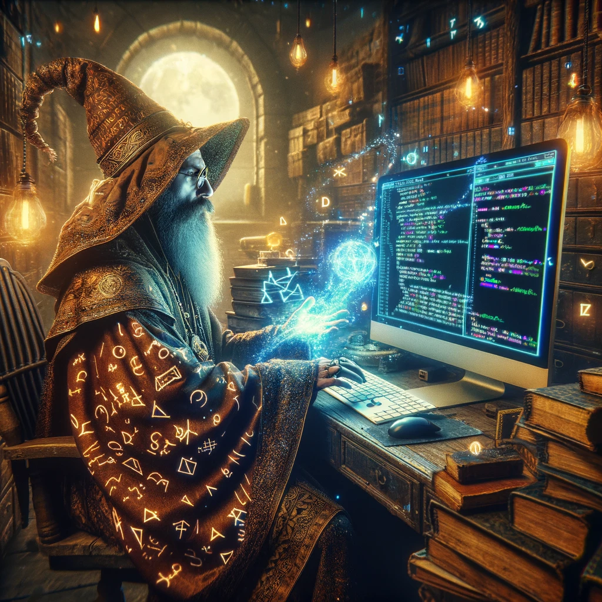

# Highlights

</img>

This project introduces OracleCoder, a state-of-the-art QLoRA+ ensemble Large Language Model (LLM) specifically engineered for high-efficiency text-to-SQL conversion. OracleCoder sets itself apart through an innovative two-phase fine-tuning approach. Initially, it employs schema linking to deepen its grasp of database architectures, thereby markedly advancing its SQL generation prowess in the latter phase through adept utilization of the schema's contextual insights. Remarkably, OracleCoder boasts the capability to be both trained and evaluated on a single NVIDIA A100 GPU, positioning it as an exceptionally efficient solution for text-to-SQL tasks.

See my [website](https://jordandeklerk.github.io/project/oraclecoder/) for the full project.
